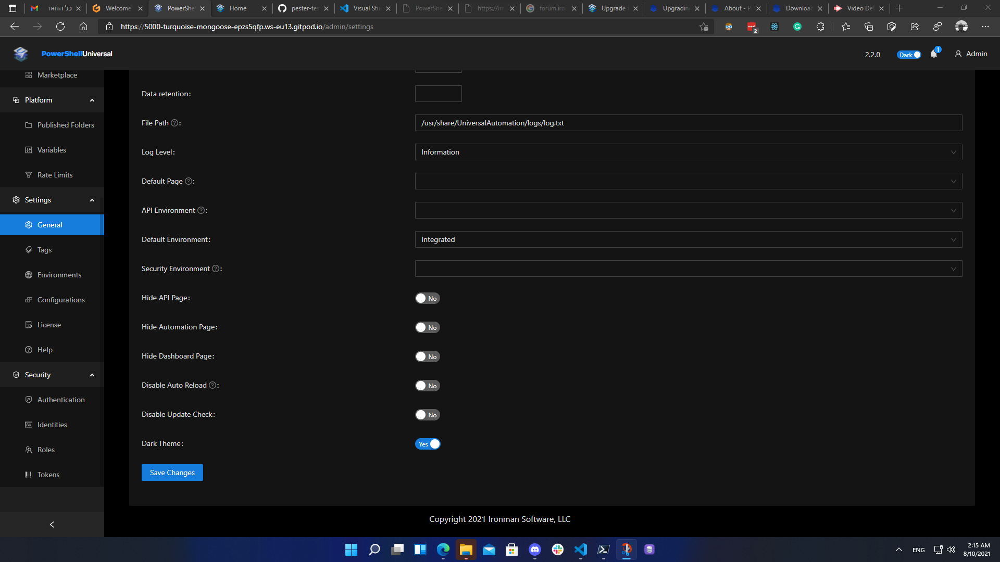
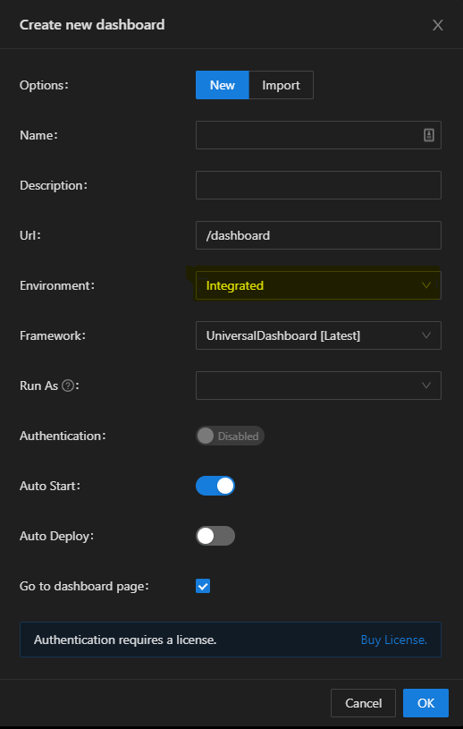

# powershell-universal-gitpod

This repository contains all the files that you need to try the latest powershell universal.

## **Options**                             

 

### Option 1                        
 

you can install this browser extention
[gitpod browser extention](https://chrome.google.com/webstore/detail/gitpod-dev-environments-i/dodmmooeoklaejobgleioelladacbeki)

this will add a green GitPod button to every repo in github

### Option 2
 

you can click on the link, you will be redirect to gitpod website and after a few seconds, a new browser tab will be open with the login page into powershell universal

[Gitpod PowerShell Universal](https://gitpod.io#snapshot/52109a30-dd42-4b70-94b2-71adfe3bd466)

## **Notes**

after you log into the admin console you need to go into `Settings --> General` 
and set `Default Environment` to Integrated and click Save.

> if you don't do this, your dashboard and pages won't work.

> when creating a dashboard you must select `Integrated` in the `Environment` menu

> 
